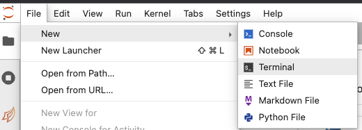

# How to use this documentation

This documentation is made as a series of Jupyter Notebooks that you can copy (or git clone) to follow-through interactively.

## Documentation Git repository

This documentation is hosted on GitHub in this repository: [https://github.com/geoanalytics-ca/documentation/](https://github.com/geoanalytics-ca/documentation/)

## Downloading this documentation into your GEOAnalytics Canada Jupyter Notebook

Before downloading this documentation, you should first be familiar with the GEOAnalytics Canada Jupyter Notebook system. Be sure to complete the [Jupyter Notebooks](03-jupyter-notebooks) tutorial before proceeding.

1. Open up your GEOAnalytics Canada Jupyter environment
2. Open up a new terminal by selecting File -> New -> Terminal

3. In the terminal type the following command. This will download the tutorials into a folder named "`tutorials`" :

`git clone https://github.com/geoanalytics-ca/documentation/ tutorials`

4.  On the left-folder navigation, open the `tutorials` folder, and open up the `.ipynb` file (which is a jupyter notebook file) that you want to work through.
